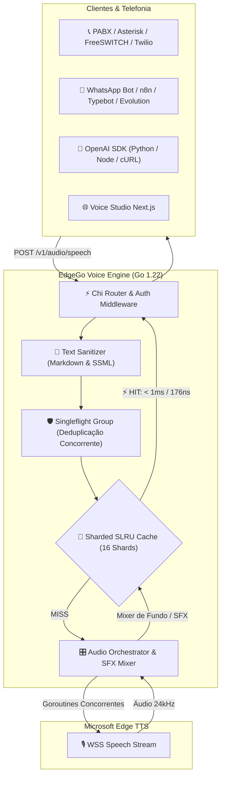

# 🔊 EdgeGo Voice

<div align="center">


**Motor Text-to-Speech (TTS) de Alta Performance em Go (100% Nativo e Gratuito), Voice Studio com AI Elements, Mixer Acústico SFX e Cache Sharded Segmented-LRU (SLRU) com Singleflight.**

[Funcionalidades](#-funcionalidades) • [Benchmarks & Performance](#-baterias-de-benchmark--performance) • [Início Rápido](#-início-rápido-com-docker) • [Voice Studio](#-painel-administrativo--voice-studio) • [API & Exemplos](#-documentação-da-api) • [Personas](#-sistema-de-personas) • [Licença](#-licença)

</div>

---

## 📖 Sobre o Projeto

O **EdgeGo Voice** é uma plataforma de síntese de voz (TTS) de altíssima performance, 100% compatível com a API da OpenAI (`/v1/audio/speech`), desenvolvida em **Go (Golang 1.22)** com painel integrado em **Next.js 14**.

Projetado especificamente para **atendimento telefônico (PABX, Asterisk, FreeSWITCH, Twilio, Vapi, Retell AI, LiveKit)**, agentes de IA e automações (**n8n**, **Typebot**, **Evolution API**), o EdgeGo Voice atua como um *drop-in replacement* gratuito com latência sub-milissegundo para frases em cache, mixer acústico de ambiente (ex: som de callcenter e digitação procedural de teclado) e proteção concorrente contra picos de tráfego.

---

## ✨ Funcionalidades

- ⚡ **Motor 100% Go Nativo & Gratuito ($0.00)**: Zero consumo de tokens ou APIs pagas de terceiros. Altíssimo throughput e baixo consumo de memória (~15MB a 30MB de RAM).
- 🧠 **Cache de Alta Performance Sharded Segmented-LRU (SLRU)**:
  - **16 Shards Independentes**: Elimina a contenção de locks exclusivos na leitura, escalando linearmente em processadores multi-core.
  - **Segmented LRU (2Q/SLRU)**: Protege saudações e frases frequentes de telefonia contra descarte acidental (*scan pollution*) através de duas filas (Probatória e Protegida).
  - **Deduplicação Concorrente (`Singleflight`)**: Evita o efeito manada (*cache stampede*). Se 30 chamadas solicitarem a mesma saudação no mesmo segundo, apenas 1 chamada ao sintetizador é realizada; as outras 29 aguardam e compartilham o mesmo buffer em memória.
  - **Zero Alocação na Leitura**: Busca em cache em apenas **176 nanosegundos** com **0 B/op e 0 allocs/op**.
- 🎧 **Mixer de Efeitos Sonoros (SFX) e Sons Ambiente**:
  - Tags de envelope para áudio de fundo contínuo: `[callcenter]...[/callcenter]`, `[ruido]`, `[ambiente]`.
  - **Simulação Procedural de Digitação Humana**: O algoritmo alterna aleatoriamente entre múltiplos arquivos de teclado com rajadas orgânicas (0.35s a 0.70s) e micro-pausas naturais de reflexão (250ms a 500ms), simulando um atendente digitando em tempo real.
  - Efeitos pontuais: `[suspiro]`, `[tosse]`, `[pigarro]`, `[risada]`.
- 🎛️ **Voice Studio Workstation**:
  - Interface unificada de estúdio profissional inspirada no shadcn/ui, Linear e ElevenLabs.
  - **AI Elements Persona**: Orbe animado em WebGL2 que reage em tempo real aos estados `idle` (repouso), `thinking` (geração ativa) e `speaking` (ondulação sincronizada com a reprodução de áudio).
  - Waveform player integrado diretamente sob a barra de ação.
  - Suporte ao atalho de teclado **`Ctrl + Enter`** para síntese imediata.
- ⏱️ **Pausas e Prosódia Naturais (SSML)**:
  - Injeção de pausas cronometradas precisas: `[pausa: 500ms]`, `[pausa: 2s]`.
  - Ajuste fino de pausas em vírgulas (`break_comma`) e pontos finais (`break_period`).
  - Controle de afinação de frequência/tom (`-20Hz` a `+20Hz`).
- 🤖 **100% Compatível com OpenAI TTS**: *Drop-in replacement* para SDKs oficiais da OpenAI (`POST /v1/audio/speech`).
- 🎭 **Sistema de Personas de Áudio**: Criação e gestão de perfis dedicados de voz via rota `/v1/persona/{id}/speech`.
- 🌐 **Internacionalização (i18n)**: Suporte a Português (Brasil), Inglês (EUA) e Espanhol (Espanha).
- 🐳 **Container Docker Minimalista**: Imagem Alpine única com Go + Next.js estático (~18MB).

---

## ⚡ Baterias de Benchmark & Performance

Os benchmarks oficiais foram executados em ambiente Linux com alocação estrita de memória (`-benchmem`):

```text
goos: linux
goarch: amd64
pkg: edgego-voice/internal/audiocache
cpu: Intel(R) Core(TM) 5 210H
```

### Resultados dos Benchmarks Unitários em Go

| Benchmark | Operações / seg | Tempo por Operação | Bytes Alocados | Alocações / op |
| :--- | :--- | :--- | :--- | :--- |
| **`BenchmarkCacheGet`** *(Leitura HIT)* | **6.577.362 ops** | **176.8 ns/op** | **0 B/op** | **0 allocs/op** |
| **`BenchmarkCacheGetMiss`** *(Leitura MISS)* | **9.200.083 ops** | **130.8 ns/op** | **0 B/op** | **0 allocs/op** |
| **`BenchmarkCacheSet`** *(Escrita Sharded)* | **13.395.030 ops** | **75.61 ns/op** | **21 B/op** | **1 alloc/op** |
| **`BenchmarkCacheMixed90Read10Write`** | **19.975.713 ops** | **58.27 ns/op** | **23 B/op** | **1 alloc/op** |
| **`BenchmarkSingleflight`** *(Deduplicação)* | **14.377.819 ops** | **80.11 ns/op** | **9 B/op** | **0 allocs/op** |
| **`BenchmarkGenerateKey`** *(Buffer Pool)* | **4.387.464 ops** | **282.5 ns/op** | **152 B/op** | **3 allocs/op** |

### Medição de Latência Ponta a Ponta (HTTP Real)

Testando a rota `/v1/audio/speech` com o container em execução:

```
1ª Chamada (Cache MISS - Síntese Edge TTS + SFX Mixer):  3.011 ms
2ª Chamada (Cache HIT - Retorno Direto da Memória RAM):      9 ms  (⚡ ~330x mais rápido)
Processamento Interno no Go em Cache HIT:                   0 ms  (< 1ms)
```

### Como Executar a Bateria de Benchmarks

Para rodar os benchmarks no seu próprio ambiente via Docker:

```bash
docker run --rm -v "${PWD}:/build" -w /build/internal/audiocache golang:1.22-alpine go test -bench="." -benchmem -v .
```

---

## 🏛️ Arquitetura do Sistema



---

## 🚀 Início Rápido com Docker

### 1. Clonar o repositório
```bash
git clone https://github.com/seu-usuario/edgego-voice.git
cd edgego-voice
```

### 2. Configurar variáveis de ambiente
Copie o arquivo `.env.example` para `.env`:
```bash
cp .env.example .env
```

### 3. Iniciar com Docker Compose
```bash
docker compose up -d --build
```

O painel e a API estarão imediatamente disponíveis em:
👉 **`http://localhost:5050`**

---

## 🖥️ Painel Administrativo & Voice Studio

1. **Voice Studio Workstation**:
   - Canvas de texto sem distrações com toolbar minimalista de efeitos (zero emojis).
   - Inspetor da Persona com o orbe animado **AI Elements Persona** indicando os estados `idle`, `thinking` e `speaking`.
   - Controles precisos de velocidade, tom e pausas em vírgulas e pontos finais.
2. **Gerenciamento de Personas**: Crie, edite e teste perfis de voz padronizados com confirmação segura de deleção.
3. **Documentação & Snippets Interativos**: Exemplos prontos de integração em cURL, Python, Node.js e Webhooks para automações.

---

## 📡 Documentação da API

### Autenticação
Envie a chave configurada no cabeçalho HTTP:
```http
Authorization: Bearer sua-chave-secreta
```

---

### 1. Síntese de Áudio Padrão (Compatível com OpenAI)

**Endpoint:** `POST /v1/audio/speech`

#### Exemplo em cURL (com Efeitos de Telefonia e Pausas):
```bash
curl -X POST http://localhost:5050/v1/audio/speech \
  -H "Authorization: Bearer minha-chave-secreta" \
  -H "Content-Type: application/json" \
  -d '{
    "model": "tts-1",
    "input": "[callcenter]Olá! Seja bem-vindo ao suporte. [pausa: 1s] Só um momento enquanto consulto seu cadastro [teclado:3s]. Pronto, já localizei seus dados![/callcenter]",
    "voice": "pt-BR-FranciscaNeural",
    "response_format": "mp3",
    "speed": 1.0
  }' \
  --output atendimento.mp3
```

#### Exemplo em Python (OpenAI SDK Oficial):
```python
from openai import OpenAI

client = OpenAI(
    base_url="http://localhost:5050/v1",
    api_key="minha-chave-secreta"
)

response = client.audio.speech.create(
    model="tts-1",
    voice="pt-BR-FranciscaNeural",
    input="[callcenter]Olá! Como posso ajudar você hoje?[/callcenter]",
    response_format="mp3"
)

response.stream_to_file("atendimento.mp3")
```

---

### 2. Síntese com Personas Dedicadas

**Endpoint:** `POST /v1/persona/{id}/speech`

```bash
curl -X POST http://localhost:5050/v1/persona/atendente-suporte/speech \
  -H "Authorization: Bearer minha-chave-secreta" \
  -H "Content-Type: application/json" \
  -d '{
    "input": "Olá! Seu chamado técnico foi registrado com sucesso."
  }' \
  --output chamado.mp3
```

---

### 3. Rotas Disponíveis

| Método | Rota | Descrição |
| :--- | :--- | :--- |
| `POST` | `/v1/audio/speech` | Síntese de áudio (Compatível com OpenAI) |
| `POST` | `/v1/persona/{id}/speech` | Síntese direta usando parâmetros da Persona |
| `GET` | `/v1/personas` | Lista todas as personas cadastradas |
| `POST` | `/v1/personas` | Cria uma nova persona |
| `GET` | `/v1/personas/{id}` | Detalhes de uma persona específica |
| `PUT` | `/v1/personas/{id}` | Atualiza uma persona existente |
| `DELETE` | `/v1/personas/{id}` | Remove uma persona |
| `GET` | `/v1/voices` | Lista as vozes neurais disponíveis e formatos |
| `GET` | `/v1/models` | Lista os modelos suportados (`tts-1`, `tts-1-hd`) |
| `GET` | `/health` | Health check em tempo real com estatísticas de RAM e cache |

---

## ⚙️ Variáveis de Ambiente (`.env`)

| Variável | Padrão | Descrição |
| :--- | :--- | :--- |
| `PORT` | `5050` | Porta HTTP do servidor |
| `HOST` | `0.0.0.0` | Interface de rede para bind |
| `API_KEY` | `minha-chave-secreta` | Chave de autenticação Bearer |
| `REQUIRE_AUTH` | `true` | Exigir chave de API em chamadas |
| `CACHE_ENABLED` | `true` | Ativa o cache Sharded SLRU em memória |
| `CACHE_MAX_MB` | `50` | Limite máximo de memória RAM alocada para áudios |
| `CACHE_TTL_HOURS` | `24` | Tempo de expiração do cache em horas |
| `DEFAULT_VOICE` | `pt-BR-FranciscaNeural` | Voz padrão caso não especificada |
| `DEFAULT_FORMAT` | `mp3` | Formato padrão (`mp3`, `wav`, `opus`, `aac`) |
| `DEFAULT_SPEED` | `1.0` | Velocidade padrão da fala (0.5x a 2.0x) |
| `REMOVE_FILTER` | `false` | Se `true`, desativa a limpeza de Markdown |
| `PROXY` | `""` | Proxy HTTP/HTTPS opcional |

---

## 👏 Créditos e Reconhecimento

Este projeto foi re-arquitetado e reescrito em **Golang** por **Rodolfo Bandeira** para fornecer performance extrema, baixa latência, interface moderna em Next.js e sistema de Personas.

A inspiração original do wrapper de integração com o serviço Edge TTS deriva do projeto em Python desenvolvido por **Samuel Santos** ([`openai-edge-tts`](https://github.com/samuel-santos/openai-edge-tts)).

---

## 📄 Licença

Distribuído sob a licença **MIT**. Consulte o arquivo [`LICENSE`](./LICENSE) para obter mais informações.

```
Copyright (c) 2026 Rodolfo Bandeira
```
