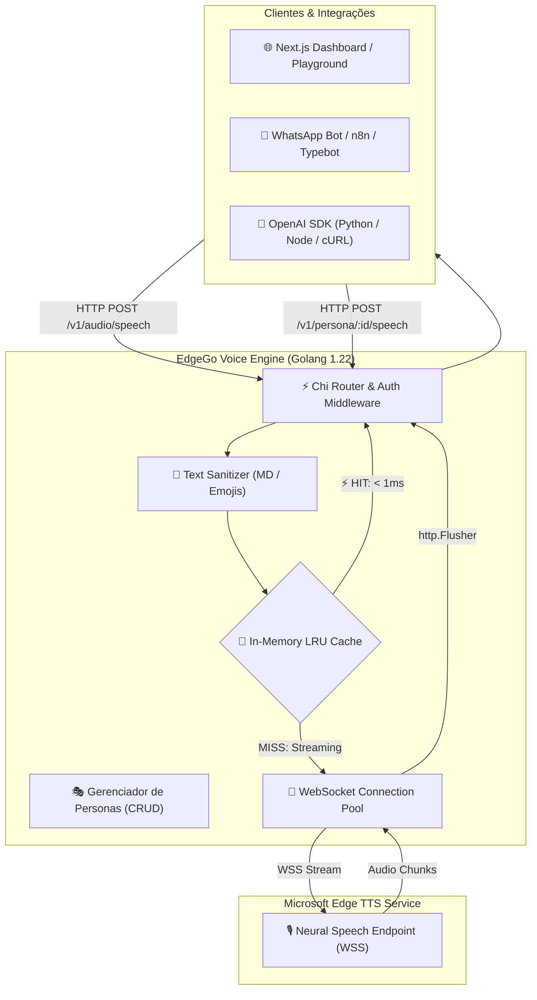

# 🔊 EdgeGo Voice

<div align="center">


**Motor Text-to-Speech (TTS) de Alta Performance em Golang com Painel Next.js Integrado, Sistema de Personas, Streaming em Tempo Real e Cache LRU em Memória.**

[Funcionalidades](#-funcionalidades) • [Início Rápido](#-início-rápido-com-docker) • [Painel Web](#-painel-administrativo-nextjs) • [API & Exemplos](#-documentação-da-api) • [Personas](#-sistema-de-personas) • [Créditos](#-créditos-e-referências) • [Licença](#-licença)

</div>

---

## 📖 Sobre o Projeto

O **EdgeGo Voice** é um servidor TTS de alta performance, compatível com a API da OpenAI (`/v1/audio/speech`), desenvolvido em **Go (Golang 1.22)** com frontend SPA em **Next.js 14**.

Ele foi projetado para atuar como um *drop-in replacement* gratuito e ultra-rápido para serviços pagos de voz em agentes de IA, fluxos de automação (**n8n**, **Typebot**, **Dify**, **Flowise**) e robôs de atendimento no WhatsApp (**Evolution API**, **Z-API**, **Z-PRO**).

---

## ✨ Funcionalidades

- ⚡ **Motor Nativo em Golang**: Consumo mínimo de memória (~20MB de RAM) e altíssimo throughput de requisições simultâneas sem bloqueio de GIL.
- 💎 **Motor Híbrido Inteligente (Edge + Azure)**: Balanceamento automático entre a API gratuita do Edge TTS (custo $0) para trechos neutros e a API da Microsoft Azure Speech para trechos com emoções, sussurros e expressões dramáticas, economizando de 80% a 95% em relação ao uso 100% pago.
- 🎭 **Tags de Emoções e Estilos**: Suporte direto no texto a `[sussurro]`, `[alegre]`, `[triste]`, `[bravo]`, `[calmo]`, `[animado]`, `[gritando]`, `[amigavel]` e SSML `<mstts:express-as>`.
- 🔊 **Banco Local de SFX (Efeitos Biológicos)**: Injeção sem custo e instantânea (<1ms) de efeitos acústicos humanos como `[som:pigarro]`, `[som:tosse]`, `[som:risada]`, `[som:suspiro]` e `[som:respiracao]`.
- 📊 **Dashboard de Tokens & Economia (Shadcn UI)**: Gráficos visuais de consumo em tempo real de tokens EdgeGo Grátis vs Azure Paga vs Cache LRU com cálculo automático da economia em dólar ($ USD).
- 🤖 **100% Compatível com OpenAI TTS**: Compatível com as SDKs oficiais da OpenAI em Python, Node.js, Go, PHP, cURL e ferramentas No-Code.
- 🎭 **Sistema de Personas de Áudio**: Crie e gerencie perfis dedicados (voz, velocidade, formato e filtros) acessíveis diretamente via rota `/v1/persona/{id}/speech`.
- 🧠 **Cache LRU em Memória Thread-Safe**: Resposta em **< 1ms** para frases repetidas através de chaveamento criptográfico SHA-256 com limite configurável de memória e expiração TTL.
- 🌊 **Streaming em Tempo Real (`http.Flusher`)**: Transmissão imediata de pacotes binários para o cliente através de pool de conexões WebSocket pré-aquecidas.
- 🌍 **Vozes Neurais Multilíngues**: Catálogo com vozes neurais de alta fidelidade para 🇧🇷 Português (Brasil), 🇵🇹 Português (Portugal), 🇺🇸 Inglês (EUA), 🇬🇧 Inglês (Reino Unido), 🇪🇸 Espanhol, 🇲🇽 México, 🇫🇷 Francês, 🇩🇪 Alemão, 🇮🇹 Italiano e 🇯🇵 Japonês.
- 🧹 **Sanitização Inteligente de Texto**: Remoção automática de marcações Markdown (`**negrito**`, `# títulos`, `[links]()`) e Emojis para fala limpa e natural.
- 🎨 **Painel Web Next.js 14 Moderno**: Interface com estética dark mode, escala global de cores, ícones Ionicons, bandeiras SVG dos países e Playground interativo com métricas de latência em tempo real.
- 🐳 **Container Único Minimalista**: Go Engine e o bundle estático do Next.js servidos na mesma porta e no mesmo container Alpine (~18MB).

---

## 🏛️ Arquitetura do Sistema



---

## 🚀 Início Rápido com Docker

### 1. Clonar o repositório
```bash
git clone https://github.com/seu-usuario/edgego-voice.git
cd edgego-voice
```

### 2. Configurar variáveis de ambiente
Copie o arquivo de exemplo `.env.example` para `.env`:
```bash
cp .env.example .env
```

### 3. Iniciar com Docker Compose
```bash
docker compose up -d --build
```

O serviço estará disponível em:
👉 **`http://localhost:5050`**

---

## 🖥️ Painel Administrativo (Next.js)

O painel administrativo integrado permite:
1. **Gerenciar Personas**: Criar, editar, testar e excluir perfis de voz.
2. **Playground TTS**: Sintetizar e escutar áudios instantaneamente com medição de TTFB, tempo total e Cache HIT.
3. **API & Snippets**: Gerar códigos prontos de integração em **cURL**, **Python** e **JavaScript**.

---

## 📡 Documentação da API

### Autenticação
Envie a chave de API configurada no cabeçalho:
```http
Authorization: Bearer sua-chave-secreta
```

---

### 1. Síntese de Áudio Padrão (Compatível OpenAI)

**Endpoint:** `POST /v1/audio/speech`

#### Exemplo em cURL:
```bash
curl -X POST http://localhost:5050/v1/audio/speech \
  -H "Authorization: Bearer minha-chave-secreta" \
  -H "Content-Type: application/json" \
  -d '{
    "model": "tts-1",
    "input": "Olá! Este é um teste do sintetizador EdgeGo Voice.",
    "voice": "pt-BR-ThalitaMultilingualNeural",
    "response_format": "mp3",
    "speed": 1.0
  }' \
  --output audio.mp3
```

#### Exemplo em Python (OpenAI SDK Oficial):
```python
from openai import OpenAI

client = OpenAI(
    base_url="http://localhost:5050/v1",
    api_key="minha-chave-secreta"
)

response = client.audio.speech.create(
    model="tts-1",
    voice="pt-BR-AntonioNeural",
    input="Olá! Estou utilizando a SDK oficial da OpenAI conectada ao EdgeGo Voice.",
    response_format="mp3"
)

response.stream_to_file("fala.mp3")
```

#### Exemplo em Node.js / TypeScript:
```typescript
import OpenAI from "openai";
import fs from "fs";

const openai = new OpenAI({
  baseURL: "http://localhost:5050/v1",
  apiKey: "minha-chave-secreta",
});

async function main() {
  const mp3 = await openai.audio.speech.create({
    model: "tts-1",
    voice: "pt-BR-FranciscaNeural",
    input: "Integrando áudio em tempo real com Node.js.",
  });
  
  const buffer = Buffer.from(await mp3.arrayBuffer());
  await fs.promises.writeFile("audio.mp3", buffer);
}

main();
```

---

### 2. Síntese com Personas Dedicadas

**Endpoint:** `POST /v1/persona/{id}/speech`

Gera áudio com os parâmetros pré-configurados da Persona (voz, formato, velocidade e filtros):

```bash
curl -X POST http://localhost:5050/v1/persona/whatsapp-suporte/speech \
  -H "Authorization: Bearer minha-chave-secreta" \
  -H "Content-Type: application/json" \
  -d '{
    "input": "Olá! Seu pedido já foi enviado e está a caminho."
  }' \
  --output suporte.opus
```

---

### 3. Gerenciamento de Personas (CRUD REST)

| Método | Rota | Descrição |
| :--- | :--- | :--- |
| `GET` | `/v1/personas` ou `/api/personas` | Lista todas as personas cadastradas |
| `POST` | `/v1/personas` ou `/api/personas` | Cria uma nova persona |
| `GET` | `/v1/personas/{id}` | Obtém os detalhes de uma persona |
| `PUT` | `/v1/personas/{id}` | Atualiza uma persona existente |
| `DELETE` | `/v1/personas/{id}` | Remove uma persona |
| `GET` | `/v1/voices` ou `/api/voices` | Lista todas as vozes neurais disponíveis |
| `GET` | `/v1/models` | Lista os modelos suportados (`tts-1`, `tts-1-hd`) |
| `GET` | `/health` | Status do servidor e estatísticas de memória do cache |

---

## ⚙️ Variáveis de Ambiente (`.env`)

| Variável | Padrão | Descrição |
| :--- | :--- | :--- |
| `PORT` | `5050` | Porta HTTP do servidor |
| `HOST` | `0.0.0.0` | Interface de rede para bind |
| `API_KEY` | `minha-chave-secreta` | Chave de autenticação Bearer |
| `REQUIRE_AUTH` | `true` | Exigir chave de API em chamadas protegidas |
| `CACHE_ENABLED` | `true` | Ativa o cache LRU em memória |
| `CACHE_MAX_MB` | `50` | Limite máximo de memória RAM para áudios em cache |
| `CACHE_TTL_HOURS` | `24` | Tempo de expiração dos áudios em cache (em horas) |
| `DEFAULT_VOICE` | `pt-BR-ThalitaMultilingualNeural` | Voz padrão caso não especificada |
| `DEFAULT_FORMAT` | `mp3` | Formato padrão (`mp3`, `opus`, `wav`, `pcm`, `aac`, `flac`) |
| `DEFAULT_SPEED` | `1.0` | Velocidade padrão da fala (0.5x a 2.0x) |
| `REMOVE_FILTER` | `false` | Se `true`, desativa a limpeza de Markdown e Emojis |
| `PROXY` | `""` | Proxy HTTP/HTTPS opcional para conexões com a Microsoft |

---

## 🇧🇷 Vozes Neurais em Destaque

| Código da Voz | Idioma / País | Gênero | Formato Recomendado |
| :--- | :--- | :--- | :--- |
| `pt-BR-ThalitaMultilingualNeural` | 🇧🇷 Português (Brasil) | Feminino | MP3 / Opus |
| `pt-BR-AntonioNeural` | 🇧🇷 Português (Brasil) | Masculino | MP3 / Opus |
| `pt-BR-FranciscaNeural` | 🇧🇷 Português (Brasil) | Feminino | MP3 / Opus |
| `pt-PT-DuarteNeural` | 🇵🇹 Português (Portugal) | Masculino | MP3 / Opus |
| `pt-PT-RaquelNeural` | 🇵🇹 Português (Portugal) | Feminino | MP3 / Opus |
| `en-US-AndrewMultilingualNeural` | 🇺🇸 Inglês (EUA) | Masculino | MP3 / Opus |
| `en-US-EmmaMultilingualNeural` | 🇺🇸 Inglês (EUA) | Feminino | MP3 / Opus |
| `en-GB-SoniaNeural` | 🇬🇧 Inglês (Reino Unido) | Feminino | MP3 / Opus |
| `es-ES-AlvaroNeural` | 🇪🇸 Espanhol (Espanha) | Masculino | MP3 / Opus |
| `es-MX-DaliaNeural` | 🇲🇽 Espanhol (México) | Feminino | MP3 / Opus |
| `fr-FR-DeniseNeural` | 🇫🇷 Francês (França) | Feminino | MP3 / Opus |
| `de-DE-KatjaNeural` | 🇩🇪 Alemão (Alemanha) | Feminino | MP3 / Opus |
| `it-IT-DiegoNeural` | 🇮🇹 Italiano (Itália) | Masculino | MP3 / Opus |
| `ja-JP-NanamiNeural` | 🇯🇵 Japonês (Japão) | Feminino | MP3 / Opus |

---

## 👏 Créditos e Referências

Este projeto foi re-arquitetado e reescrito do zero em **Golang** por **Rodolfo Bandeira** para fornecer performance extrema, baixa latência, interface moderna em Next.js e sistema de Personas.

A inspiração original do wrapper de integração com o serviço Edge TTS deriva do projeto em Python desenvolvido por **Samuel Santos** ([`openai-edge-tts`](https://github.com/samuel-santos/openai-edge-tts)). Agradecemos à comunidade open-source e aos mantenedores do protocolo Microsoft Edge TTS.

---

## 📄 Licença

Distribuído sob a licença **MIT**. Consulte o arquivo [`LICENSE`](./LICENSE) para obter mais informações.

```
Copyright (c) 2026 Rodolfo Bandeira
```
